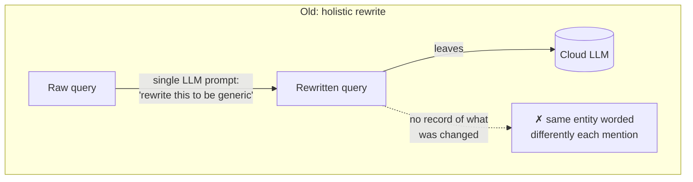
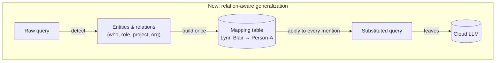

# Beyond Redaction: Project Overview

*Prepared for supervisor review — 24 August 2026*

## What

*Beyond Redaction* is a privacy defense for LLM queries that runs entirely **on-device** — on the phone or laptop, before a query ever reaches a cloud LLM. Instead of just deleting obvious PII (names, emails, phone numbers), it rewrites the query so that the *relationships* between people, roles, and projects — the organizational structure — aren't reconstructable by the cloud provider either.

## Why

Deleting PII strings isn't enough. Even with names and emails stripped, the surrounding context often still reveals "who reports to whom" and "who's linked to which project." A cloud-side adversary can reconstruct an organization's internal structure from that pattern alone, without ever seeing an actual name. Existing redaction methods don't address this because they only look at individual sensitive tokens, not the relationships between them.

We tested this claim on the Enron email corpus: an adversarial LLM tries to reconstruct an organization's structure from raw emails, then again from the defended versions. In an early evaluation, the existing single-prompt rewrite approach leaked meaningful structure on **every single test document** — proving the problem is real, and that a plain redaction rewrite doesn't solve it.

## How

We built a defense that explicitly models entities and their relationships, rather than just rewriting text and hoping:

1. Detect the people, roles, organizations, and projects in a query.
2. Detect how they relate to each other.
3. Replace each one with a consistent placeholder (same person → same placeholder, every time), so the query still makes sense but nothing links back to a real identity.

Measured against the same test set, this cut structural leakage by roughly half compared to the plain rewrite approach, and we've now confirmed it runs fast enough to be practical on real phones — tested on an actual iPhone and Android device, not just a simulator.

## Architecture

The two diagrams below show the actual mechanism difference, not just the labels. The old approach has no memory of what it rewrote — the same person can come out worded two different ways in two different sentences, which is exactly the seam an adversary exploits. The new approach builds a per-document mapping table first, so every mention of the same entity gets the same placeholder everywhere, and the swap is done by code rather than by asking a model to comply.

**What changed:** the mapping table. It's the difference between "hope the rewrite is consistent" and "guarantee it is." Everything downstream — what the cloud LLM sees, what an adversary can reconstruct — depends on that one addition.

## Results

We measured **Structural Exposure Retention (SER)** — how much of an organization's structure an adversary can still reconstruct after the defense runs. Lower is better.

| | Old (holistic rewrite) | New (relation-aware) |
|---|---|---|
| SER — mean | 0.393 | **0.209** |
| SER — median | 0.345 | **0.200** |
| Personal-name leak rate | 10.9% | **8.7%** |

Tested on the same 50 documents for both. The new approach improved results on 29 of 50, was worse on 8, and tied on 13 — a real, mixed-but-net-positive result.

We also confirmed the defense runs fast enough to be practical on real devices — not simulators:

| Platform | Typical latency per query |
|---|---|
| macOS (laptop) | 14.2 ms |
| iPhone 16 Pro Max (real device) | **0.83 ms** |
| Pixel 7 Pro (real device) | 5.83 ms |

## Open Questions for You

1. Sign-off that this relationship-aware approach is the right direction to build the paper around.
2. Should we keep building (porting the remaining on-device LLM piece to phones), or start drafting the paper with what we have now?
3. Venue and page budget — still undecided, and it affects how much of this the paper can actually cover.
